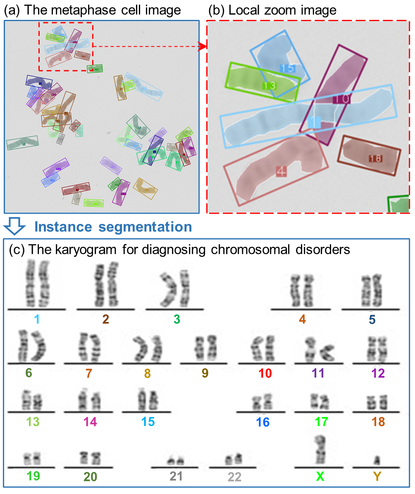

# chromosome-instance-segmentation-dataset
This is the dataset for the ICME2023 paper: AutoKary2022: A Large-Scale Densely Annotated Dateset for Chromosome Instance Segmentation (If you use this dataset, you have to cite the paper!)
Data available at the baidu cloud:https://pan.baidu.com/s/1RMXQUYFtGqeYv2g13I27TA 
download code：**q5bo** 

